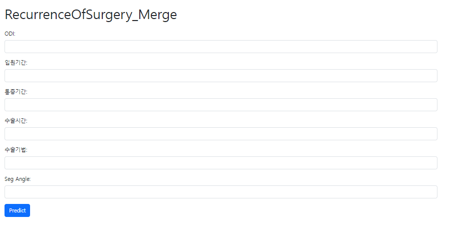
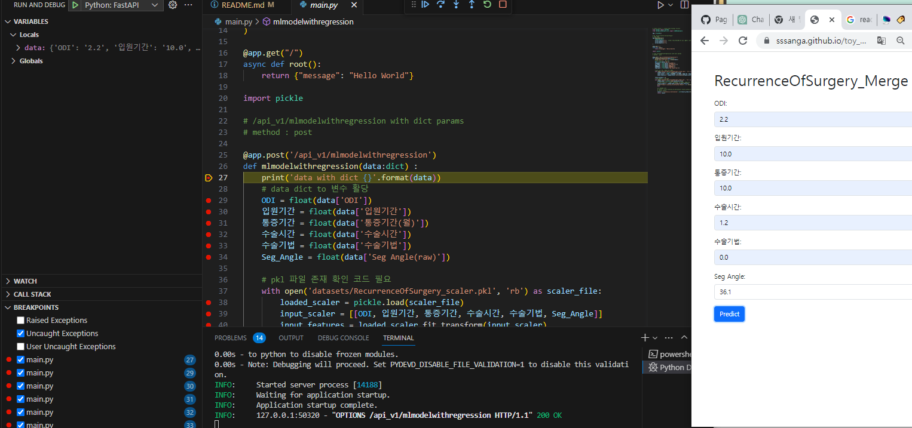
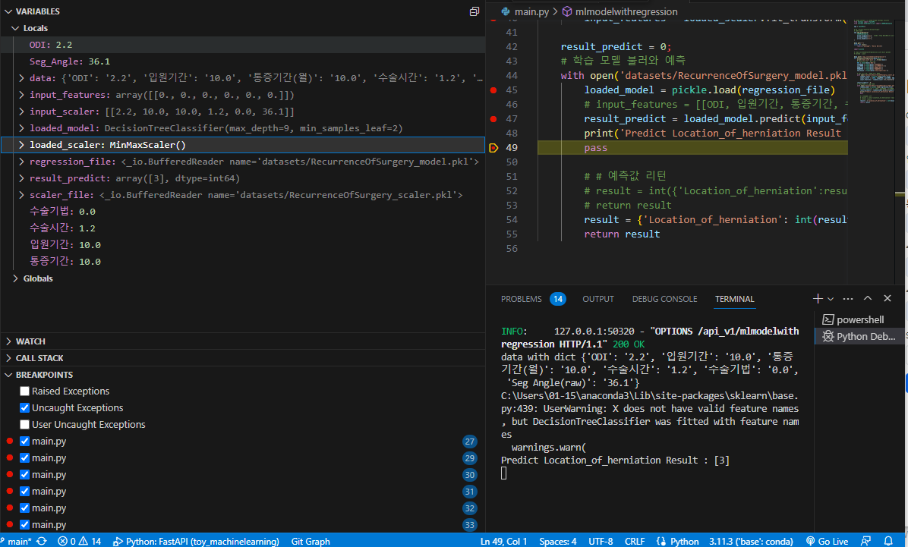
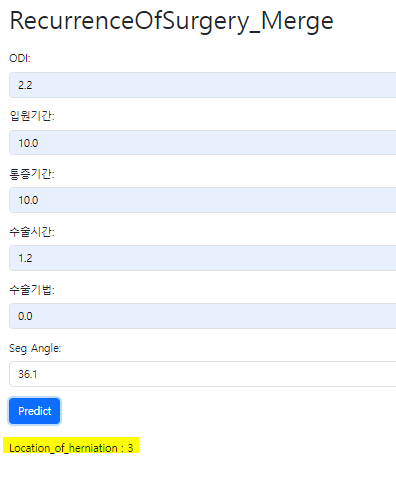

### machineLearning Quest

#### 서비스 목적?
- 의사 
- 탈출한 디스크의 위치가 ODI(= 척추 통증 장애 지수) 입원기간과 밀접한 관계가 있는지
- 탈출한 디스크의 위치가 입원기간과 밀접한 관계가 있는지
- 탈출한 디스크의 위치가 통증기간과 밀접한 관계가 있는지
- 탈출한 디스크의 위치가 수술시간 or 수술기법에 밀접한 관계가 있는지
- 탈출한 디스크의 위치와 척추 각도와 밀접한 관계가 있는지 

#### 변수들
- 목표변수 (범주형) : 탈출한 디스크의 위치 Location of herniation 1,2,3,4,5
- 설명변수: ODI, 입원기간, 통증기간, 수술시간, 수술기법, Seg Angle(raw)

#### 전처리 하기 전 결과 by.하늘 

| 비교-순서 | precision | recall | f1-score | support |
|-----------|-----------|--------|----------|---------|
| 1         | 0.50      | 0.11   | 0.18     | 18      |
| 2         | 0.00      | 0.00   | 0.00     | 30      |
| 3         | 0.45      | 0.98   | 0.62     | 51      |
| 4         | 0.00      | 0.00   | 0.00     | 15      |
| 5         | 0.00      | 0.00   | 0.00     | 1       |

Accuracy: 0.45

Macro Avg: 0.19, 0.22, 0.16

Weighted Avg: 0.28, 0.45, 0.30

#### 전처리 후 결과 by.하늘 + 상아

| 비교분류 | precision | recall | f1-score | support |
|-----------|-----------|---------|----------|----------|
| 1         | 0.68      | 0.70    | 0.69     | 125      |
| 2         | 0.64      | 0.57    | 0.60     | 156      |
| 3         | 0.65      | 0.74    | 0.69     | 154      |
| 4         | 0.41      | 0.40    | 0.41     | 30       |
| 5         | 0.50      | 0.11    | 0.18     | 9        |

Accuracy: 0.64

Macro Avg: 0.58, 0.50, 0.51

Weighted Avg: 0.64, 0.64, 0.63

#### main 이용 by.하늘

🙂 [git_html](https://sssanga.github.io/toy_machinelearning/RecurrenceOfSurgery_Merge.html)

- 진행 및 결과

    - browser 실행하면 main.py 걸림 

    - scaler.pkl 과 model.pkl로 입력값이 들어감

    - Location of herniation의 예측값이 출력됨. 